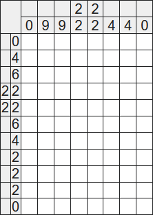
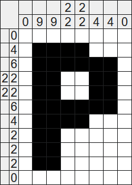
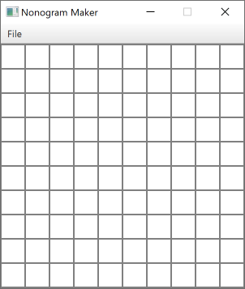
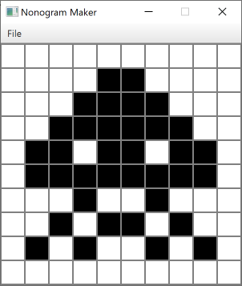
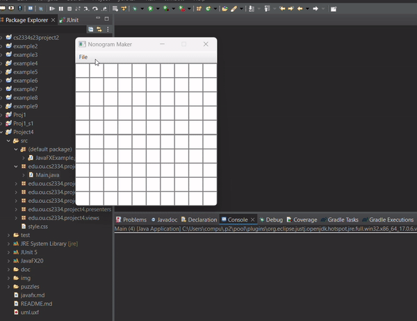
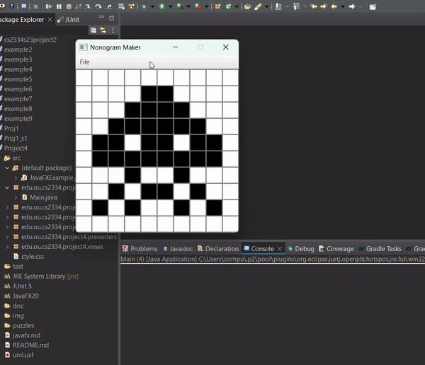
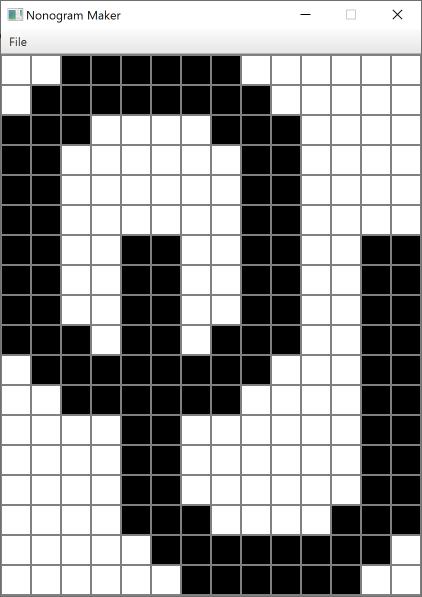
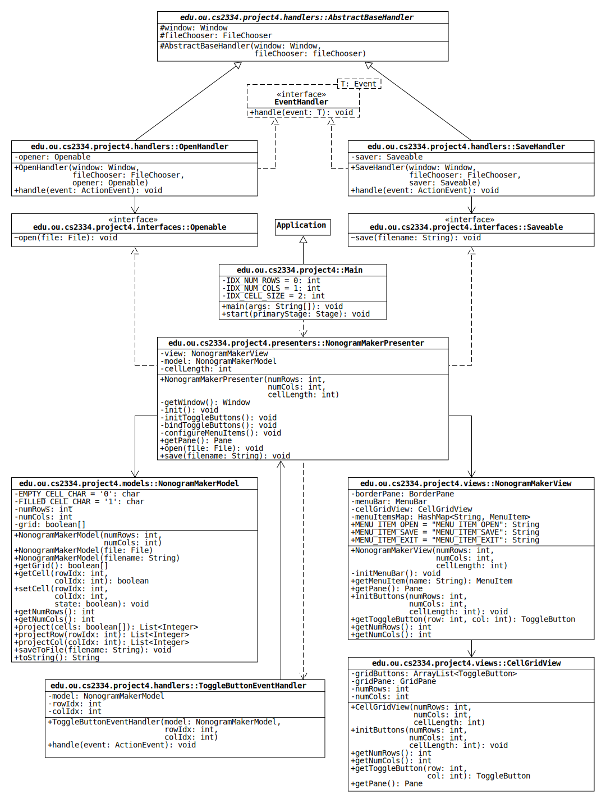

# A Simple Nonogram Maker

A nonogram consists of a grid of cells in which each row and each column are labeled by a list of numbers.
The cells can be in two states, empty or filled, and the numbers indicate which cells are filled.
Specifically, the numbers are the lengths of the contiguous groups of filled cells in the row or column.
The cells are initially empty, and the goal is to fill the correct cells to satisfy the numbers.

Here is an example [from Wikipedia](https://en.wikipedia.org/wiki/Nonogram#Example):



The 0 that labels the first row indicates that none of the cells are filled.
The 4 that labels the second row indicates that 4 of the 8 cells are filled, and there are no empty cells between any pair of filled cells (i.e., the filled cells are in a single contiguous group).
The pair of 2s that labels the fourth row indicates that there are two contiguous groups of 2 filled cells, and the groups are separated by one or more empty cells.

The solution to the puzzle is shown below, and it illustrates the feature of nonograms that is responsible for their popularity: Solving the puzzle reveals a hidden [binary image](https://en.wikipedia.org/wiki/Binary_image)!
In this example, the image is a boring letter P, but puzzles can be generated from any two-color [pixel art](https://en.wikipedia.org/wiki/Pixel_art).



For this project, we will write a nonogram puzzle maker.
The program will have a graphical interface that allows a user to draw a binary image.
The program will take this image and calculate the row and column numbers of the corresponding nonogram.

## User Interface Description

This program runs using command line arguments specifying the number of rows, number of columns, and cell length (i.e., the size of a square).

```console
$ Main <numRows> <numCols> <cellLength>
```

When the program starts, the user is shown an empty cell grid of the specified dimensions:



The user draws an image by clicking on cells, which toggles their state from empty to filled (or vice versa).
For instance, here is a recreation of one of the alien [sprites](https://en.wikipedia.org/wiki/Sprite_(computer_graphics)) from the 1978 arcade game [*Space Invaders*](https://en.wikipedia.org/wiki/Space_Invaders):



The top of the window has a menu bar with a menu option called **File**. By clicking on the **File** option, the user is given three options: **Open**, **Save**, or **Exit**. Open is used to load a puzzle file. Save is used to save the nonogram to a file. Exit is used to close the program.

### Opening a Puzzle



### Saving a Puzzle



Clicking the save button using the Space Invaders pattern creates allows us to save a text file with the following content:

```text
10 10
0
2
4
6
2 2 2
8
1 1
1 2 1
1 1 1 1
0
0
2 1
3 1
2 2 1
5 1
5 1
2 2 1
3 1
2 1
0
0000000000
0000110000
0001111000
0011111100
0110110110
0111111110
0001001000
0010110100
0101001010
0000000000
```


The first line contains the dimensions of the cell grid: the number of rows *R* followed by the number of columns *C*.
The next *R* lines contain the nonogram numbers for the rows in order from top to bottom with one row per line.
Similarly, the final *C* lines contain the nonogram numbers for the columns in order from left to right with one column per line.
The remaining lines represent the rows and columns of the cell grid where 0s represent empty cells and 1s represent filled cells.

Below is a second example recreating the OU logo.
The text files for both examples can be found in the [puzzles](puzzles) directory of this repository



## Program Design

The nonogram maker consists of the classes shown in the UML diagram below.
(See [uml.pdf](img/uml.pdf) for a larger version.)


